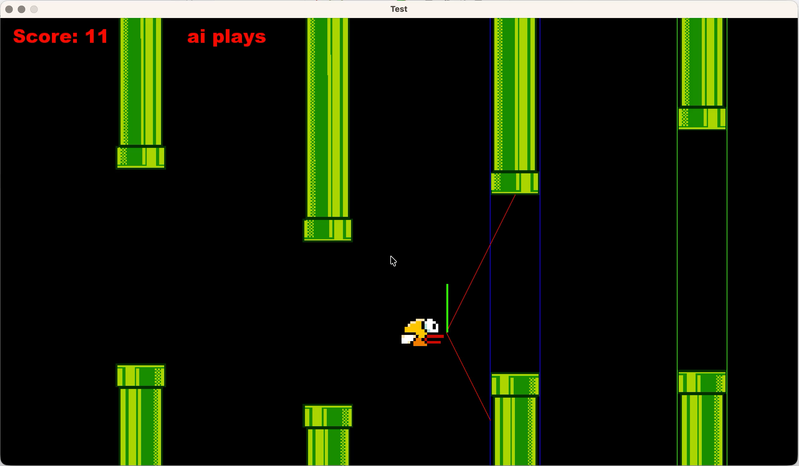
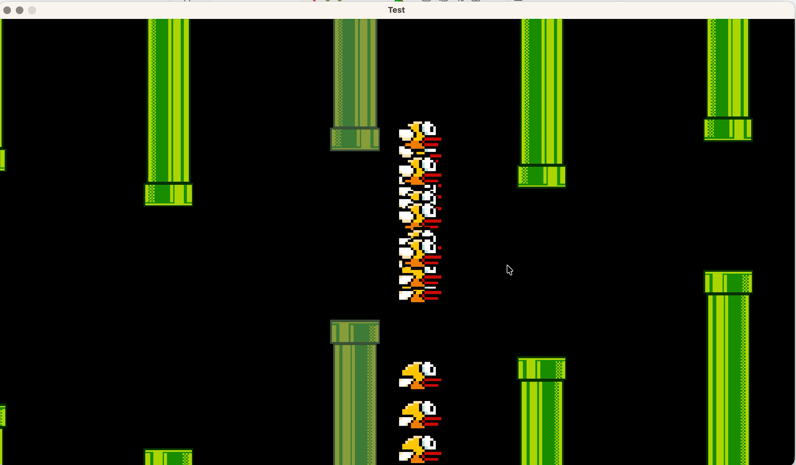
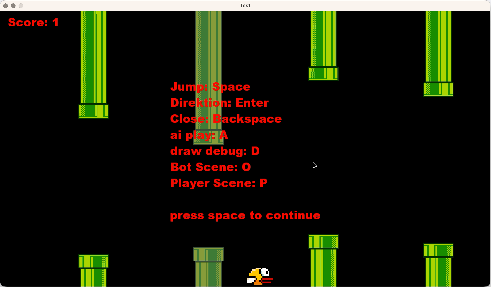

# Flappy Bird mit KI-Training

Dieses Projekt ist eine eigene Umsetzung des klassischen Flappy-Bird-Spiels mit C++ und SFML 2. Neben der normalen Spielmechanik enthält es außerdem einen trainierbaren Bot-Modus, der das Spiel autonom steuert und die Entscheidungen eines einfachen neuronalen Netzwerks nutzt.

## Hauptfunktionen

- Eigenständige Spielimplementierung mit SFML 2
- Darstellung von Spielwelt, Vogel, Rohren und Spielzuständen
- Manuelles Spielen im Player-Modus
- Bot-Modus mit neuronalen Netzwerken zur Steuerung des Vogels
- Visualisierung wichtiger Eingabedaten im Debug-Screen
- Mehrere Szenen wie Laufzeit, Pause und Game Over
- Modularer Aufbau mit separaten Klassen für Engine, Szenen, Sensoren und Netzwerk

## Technische Umsetzung

Das Projekt verwendet eine klassische Architektur aus mehreren Komponenten:

- Engine: Verwaltung des Spielloops und Gesamtsystems
- Szenen: Aufteilung in verschiedene Zustände des Spiels
- Bird: Logik und Darstellung des Vogels
- Pipe / GhostPipe: Hindernisse und Darstellung im Spiel
- Sensor: Berechnung der relevanten Werte für die KI
- Network: Einfache neuronale Netzanalyse für die Entscheidung, ob gesprungen werden soll

Die KI erhält dabei relevante Informationen wie Positionen, Abstände und Geschwindigkeiten und entscheidet anhand dieser Werte, ob der Vogel springen soll.

## Voraussetzungen

- C++17
- CMake
- SFML 2

## Visualisierung und Training

Die Readme zu diesem Projekt zeigt auch die wichtigsten visuellen Zustände der Anwendung:

Der Debugscreen während die KI spielt:

Training des neuronalen Netzwerks:

Pause Screen:

